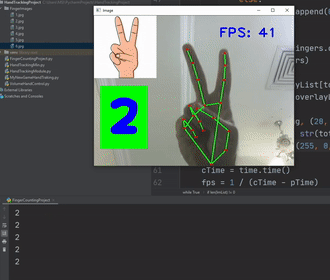
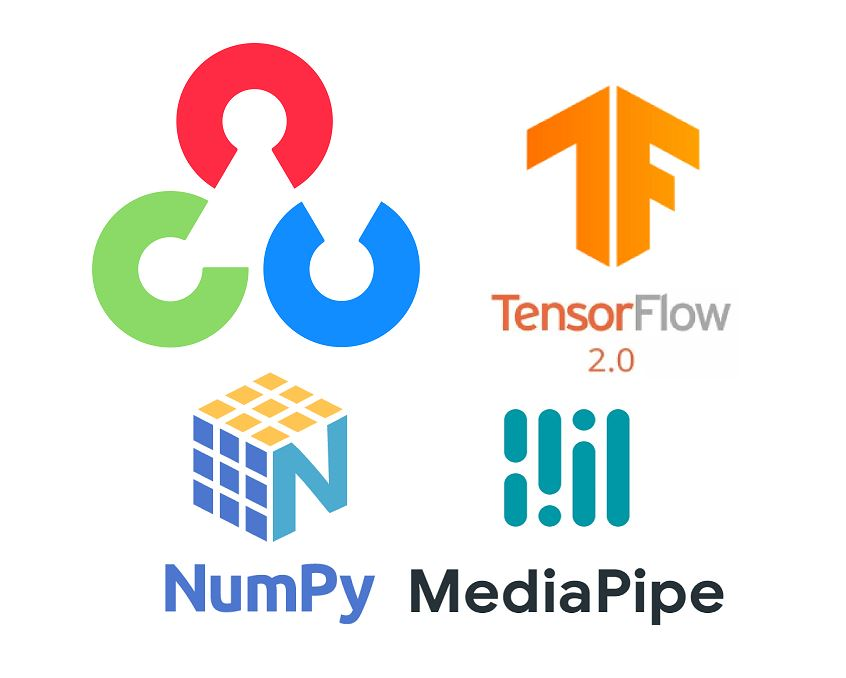

# Finger-Counter-using-Hand-Tracking-using-OpenCV

## Table of Content ##
- [Overview](#overview) 
- [Motivation](#motivation) 
- [Installation](#installation) 
- [About the MediaPipe](#about-the-mediapipe) 
- [Libraries Used](#libraries-used) 
- [Code Snippets](#code-snippets)
- [Deployment](#deployment)  
- [Team](#team) 

## Overview 
To build how to count fingers with images. We first look into hand tracking and then we will use the hand landmarks to count of the fingers. OpenCV is a library used for computer vision applications. With help of OpenCV, we can build an enormous number of applications that work better in real-time. Mainly it is used for image and video processing. We’ve used MediaPipe and Tensorflow framework for the detection and gesture recognition respectively. Here we’ve learned about the basics of the Neural Network, File handling, some common image processing techniques, etc.



## Motivation 
The motivation for developing computer vision projects is the human vision system which is richest sense that we have. I heard about omplex cameras are being integrated into many devices (Smartphones how have cameras producing depth images as well as colour images, wide angle cameras are being integrated into cars so that a birds-eye image can be created, cameras are appearing in smart glasses) and this in turn is pushing the development of progressively more complex vision systems. SO that is big mmotivation to me for learning opencv and basics of computer vision projects.

## Installation 
The Code is written in Python 3.7. If you don't have Python installed just [clik here](https://www.python.org/downloads/) and install python on your system. 
If you are using a lower version of Python you can upgrade using the pip package, ensuring you have the latest version of pip. To install the required packages and libraries, such as opencv, numpy and mediapipe that's it

``` python

Install the required modules

–> pip install opencv-python
-> pip install numpy
–> pip install mediapipe
-> pip install tensorflow
```

## About the MediaPipe

MediaPipe is a framework mainly used for building audio, video, or any time series data. With the help of the MediaPipe framework, we can build very impressive pipelines for different media processing functions.

Some of the major applications of MediaPipe.

* Multi-hand Tracking
* Face Detection
* Object Detection and Tracking
* Objectron: 3D Object Detection and Tracking
* AutoFlip: Automatic video cropping pipeline etc.


## Libraries Used 

[]

## Code Snippets

``` python

# Install the Libraries
import cv2
import os
import time
import Hand_Tracking_Module as htm

```
``` python
# Set Web Cam
cap = cv2.VideoCapture(0)
wCam = 640
hCam = 480

cap.set(3, wCam)
cap.set(4, hCam)
```
``` python
# Reading Images
FolderPath = "FingerImages"
MyList = os.listdir(FolderPath)
print(MyList)
overlayList = []
for imPath in MyList:
    image = cv2.imread(f'{FolderPath}/{imPath}')
    #print(f'{FolderPath}/{imPath}')
    overlayList.append(image)

print(len(overlayList))
pTime = 0
```
``` python
# Function Start
detector = htm.handDetector(detectionCon=0.75)

tipIds = [4, 8, 12, 16, 20]

while True:

    success, img = cap.read()
    img = detector.findHands(img)
    lmlist = detector.findPosition(img, draw=False)
    #print(lmlist)

    if len(lmlist) != 0:
        fingers = []
```

``` Consider Thumps for unique hand landmark
        #Thumps

        if lmlist[tipIds[0]][1] > lmlist[tipIds[0]-1][1]:
            fingers.append(1)
        else:
            fingers.append(0)
        # Four Fingers
        for id in range(1, 5):
            if lmlist[tipIds[id]][2] < lmlist[tipIds[id]-2][2]:
                fingers.append(1)
            else:
                fingers.append(0)

```

``` python
# Consider other four gingers for unique hand landmark
        # Printing Number of Fingers

        totalFingers = fingers.count(1)
        print(totalFingers)


        h, w, c = overlayList[totalFingers-1].shape
        img[0:h, 0:w] = overlayList[totalFingers-1]

        cv2.rectangle(img, (20, 225), (170, 425), (0, 255, 0), cv2.FILLED)
        cv2.putText(img, str(totalFingers), (45, 375), cv2.FONT_HERSHEY_SIMPLEX, 5, (255, 0, 0), 25)
```
``` python 

# FPS Calculation
    cTime = time.time()
    fps = 1 / (cTime-pTime)
    pTime = cTime

    cv2.putText(img, f'FPS:{int(fps)}', (400, 70), cv2.FONT_HERSHEY_SIMPLEX, 1, (220, 20, 60), 2)

    cv2.imshow("Image", img)
    cv2.waitKey(1)

```
## Deployment 

There is no Deployment now, maybe in the future this project definitely gonna deploy.

## Team


